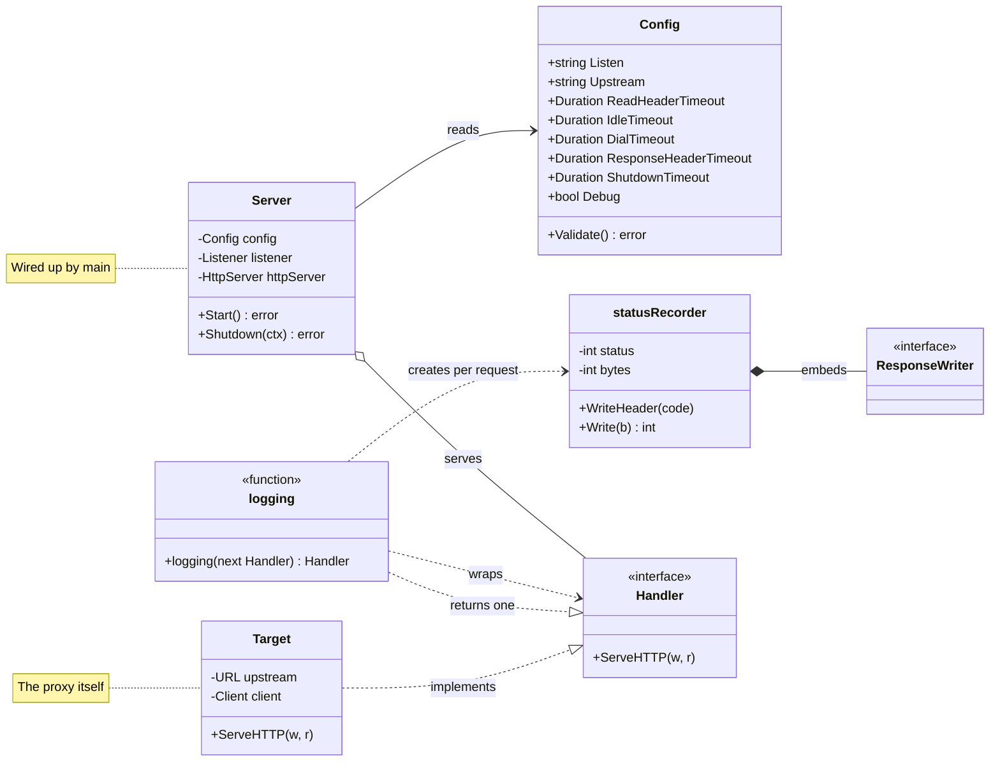

# v0 class diagram

Single-upstream HTTP reverse proxy.

```mermaid
classDiagram
    direction LR

    class Config {
        +string Listen
        +string Upstream
        +Duration ReadHeaderTimeout
        +Duration IdleTimeout
        +Duration DialTimeout
        +Duration ResponseHeaderTimeout
        +Duration ShutdownTimeout
        +bool Debug
        +Validate() error
    }

    class Target {
        -URL upstream
        -Client client
        +ServeHTTP(w, r)
    }

    class Server {
        -Config config
        -Listener listener
        -HttpServer httpServer
        +Start() error
        +Shutdown(ctx) error
    }

    class statusRecorder {
        -int status
        -int bytes
        +WriteHeader(code)
        +Write(b) int
    }

    class logging {
        <<function>>
        +logging(next Handler) Handler
    }

    class Handler {
        <<interface>>
        +ServeHTTP(w, r)
    }

    class ResponseWriter {
        <<interface>>
    }

    Target ..|> Handler : implements
    logging ..|> Handler : returns one
    logging ..> Handler : wraps
    logging ..> statusRecorder : creates per request
    statusRecorder *-- ResponseWriter : embeds
    Server o-- Handler : serves
    Server --> Config : reads

    note for Target "The proxy itself"
    note for Server "Wired up by main"
```