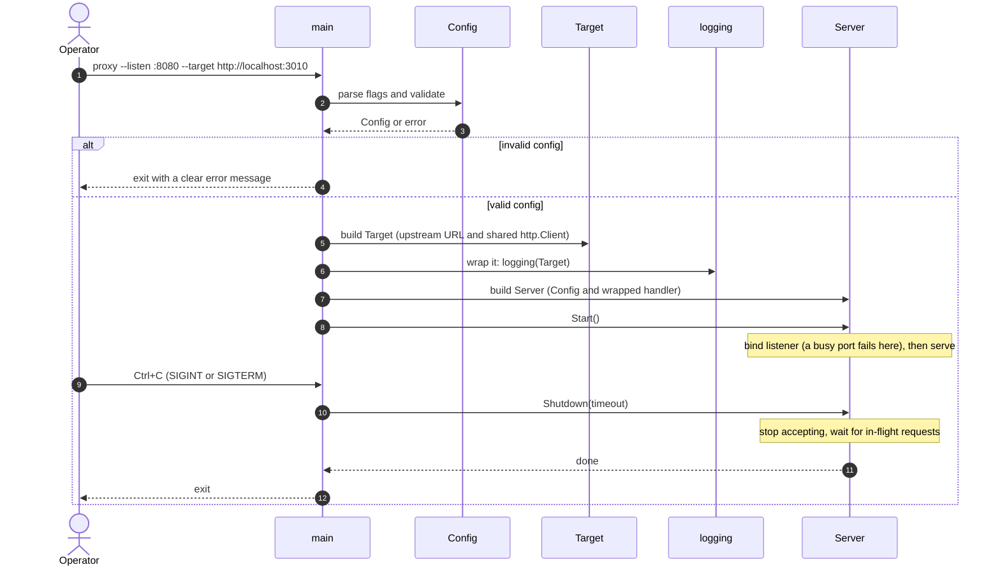
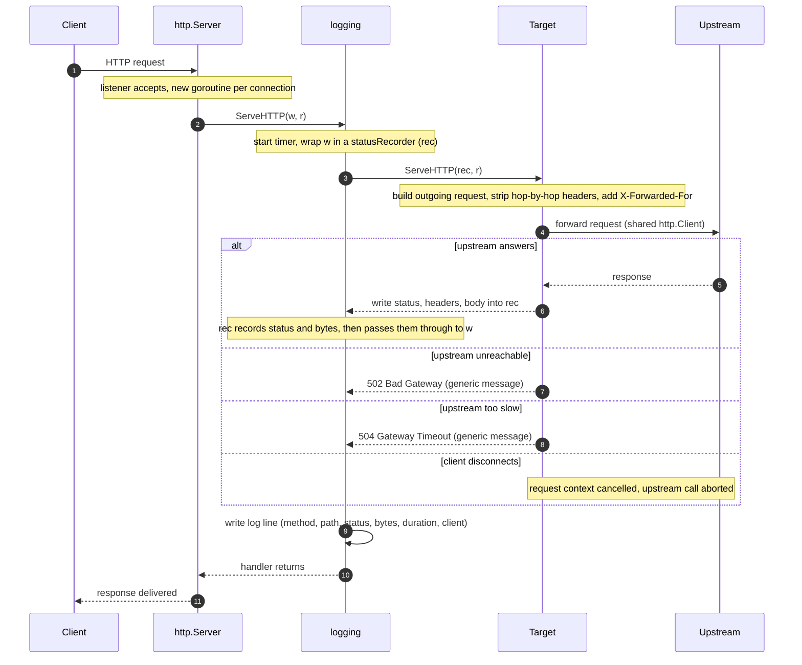

# v0 sequence diagrams

Single-upstream HTTP reverse proxy. Renders on GitHub as-is.

## 1. Startup and shutdown

```mermaid
sequenceDiagram
    autonumber
    actor Op as Operator
    participant M as main
    participant Cfg as Config
    participant T as Target
    participant L as logging
    participant S as Server

    Op->>M: proxy --listen :8080 --target http://localhost:3010
    M->>Cfg: parse flags and validate
    Cfg-->>M: Config or error
    alt invalid config
        M-->>Op: exit with a clear error message
    else valid config
        M->>T: build Target (upstream URL and shared http.Client)
        M->>L: wrap it: logging(Target)
        M->>S: build Server (Config and wrapped handler)
        M->>S: Start()
        Note over S: bind listener (a busy port fails here), then serve
        Op->>M: Ctrl+C (SIGINT or SIGTERM)
        M->>S: Shutdown(timeout)
        Note over S: stop accepting, wait for in-flight requests
        S-->>M: done
        M-->>Op: exit
    end
```

## 2. One request

```mermaid
sequenceDiagram
    autonumber
    participant C as Client
    participant S as http.Server
    participant L as logging
    participant T as Target
    participant U as Upstream

    C->>S: HTTP request
    Note over S: listener accepts, new goroutine per connection
    S->>L: ServeHTTP(w, r)
    Note over L: start timer, wrap w in a statusRecorder (rec)
    L->>T: ServeHTTP(rec, r)
    Note over T: build outgoing request, strip hop-by-hop headers, add X-Forwarded-For
    T->>U: forward request (shared http.Client)
    alt upstream answers
        U-->>T: response
        T-->>L: write status, headers, body into rec
        Note over L: rec records status and bytes, then passes them through to w
    else upstream unreachable
        T-->>L: 502 Bad Gateway (generic message)
    else upstream too slow
        T-->>L: 504 Gateway Timeout (generic message)
    else client disconnects
        Note over T,U: request context cancelled, upstream call aborted
    end
    L->>L: write log line (method, path, status, bytes, duration, client)
    L-->>S: handler returns
    S-->>C: response delivered
```